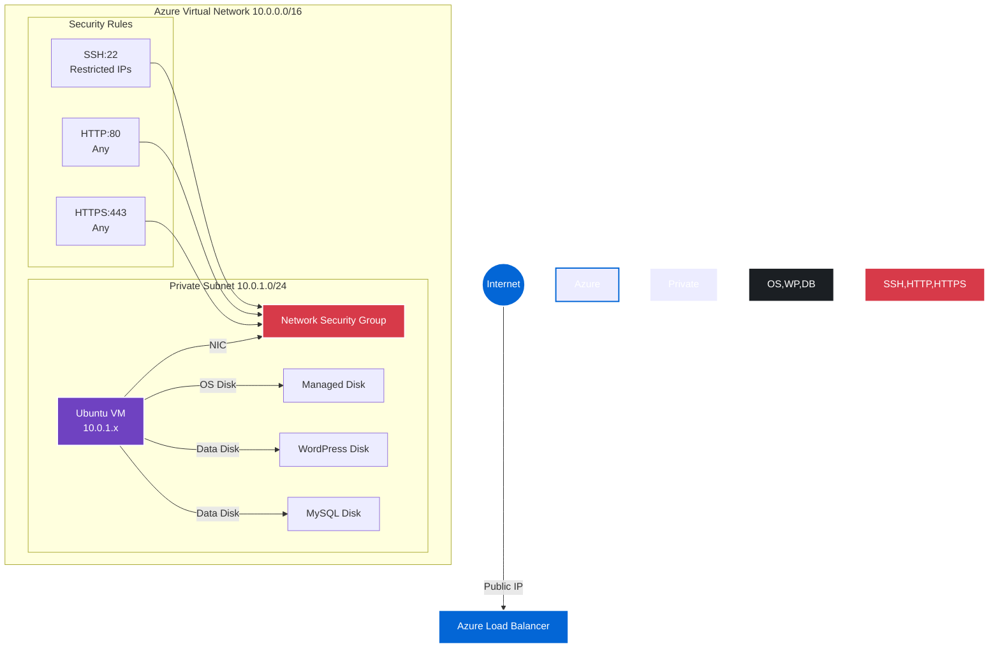
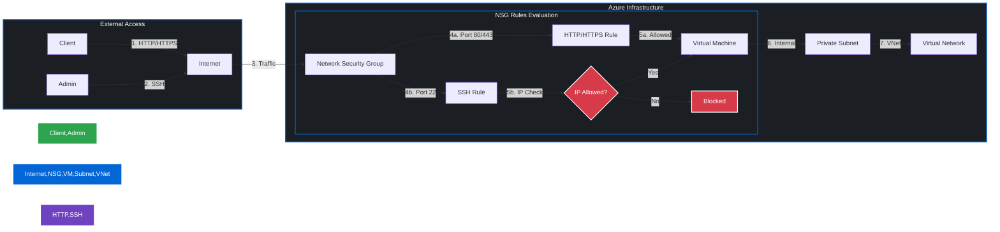
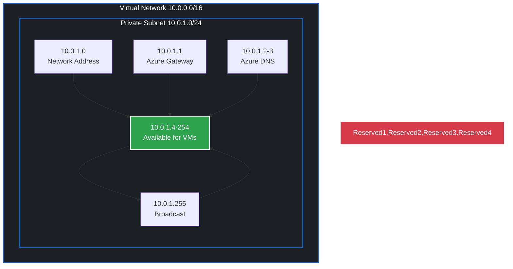
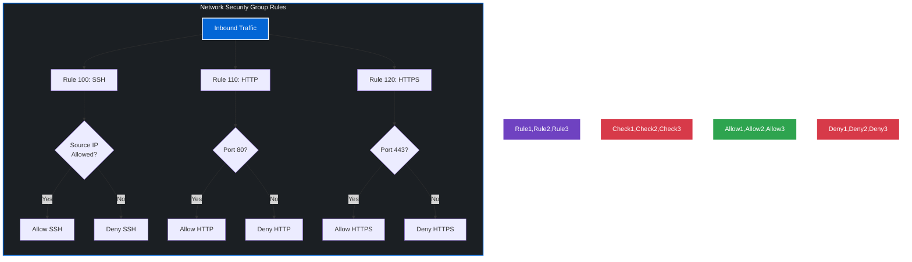
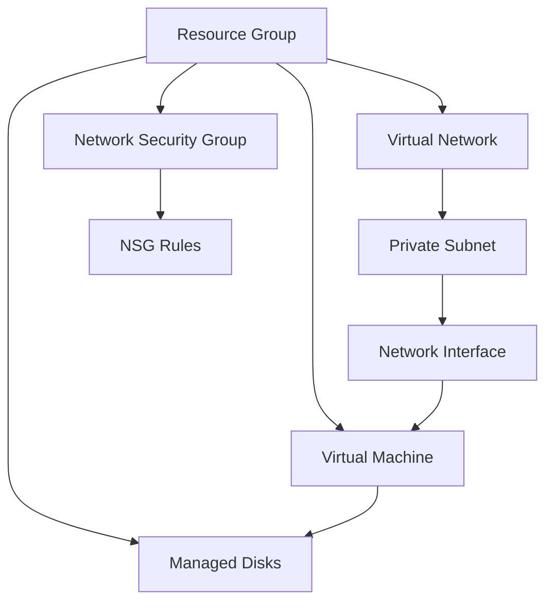
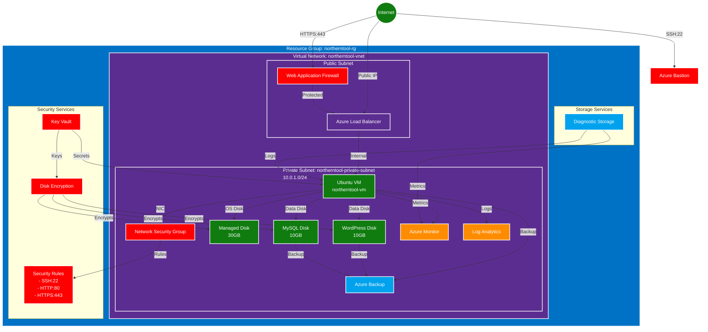

# terraform-learn

Learning terraform basics

# Azure Terraform Infrastructure 

## Network Architecture

### High-Level Network Diagram


### Network Flow Diagram


### IP Address Allocation


### Security Rules Flow


### Resource Dependencies


## Detailed Resource Analysis

### 2. Virtual Network (`azurerm_virtual_network`)
```hcl
resource "azurerm_virtual_network" "vnet" {
  name                = "northerntool-vnet"
  address_space       = [var.vnet_cidr]  # 10.0.0.0/16
  location            = var.location
  resource_group_name = azurerm_resource_group.rg.name
  tags                = local.common_tags
}
```
- **CIDR Block**: 10.0.0.0/16 provides 65,536 IP addresses (2^16)
- **Subnetting**: Currently using 10.0.1.0/24 (256 addresses) for private subnet
- **IP Allocation**: 
  - First 4 IPs and last IP are reserved by Azure
  - Available IPs: 10.0.1.4 to 10.0.1.254


### 3. Network Security Group (`azurerm_network_security_group`)
```hcl
resource "azurerm_network_security_group" "nsg" {
  # ... configuration ...
  security_rule {
    name                       = "SSH"
    priority                   = 100
    direction                  = "Inbound"
    access                     = "Allow"
    protocol                   = "Tcp"
    source_port_range          = "*"
    destination_port_range     = "22"
    source_address_prefix      = var.allowed_ssh_ip
    destination_address_prefix = "*"
  }
  # ... other rules ...
}
```
- **Rule Priority**: 
  - Lower numbers (100-4096) are evaluated first
  - Current priorities: SSH(100), HTTP(110), HTTPS(120)
- **Default Rules**:
  - All inbound traffic from VNet is allowed
  - All outbound traffic is allowed
  - All other traffic is denied
- **Rule Evaluation**:
  1. Process rules in priority order
  2. Stop at first match
  3. If no match, apply default rule

### 4. Virtual Machine (`azurerm_linux_virtual_machine`)
```hcl
resource "azurerm_linux_virtual_machine" "vm" {
  name                = "northerntool-vm"
  size                = var.vm_size  # Standard_B2s
  admin_username      = "northernadmin"
  # ... other configuration ...
}
```
- **VM Specifications**:
  - Size: Standard_B2s (2 vCPUs, 4 GB RAM)
  - OS: Ubuntu 20.04 LTS
  - Disk: 30GB OS disk (Standard_LRS)
- **Authentication**:
  - Password authentication disabled
  - SSH key-based authentication only
  - Key path configurable via variable
- **Performance Considerations**:
  - B-series VMs are burstable
  - Good for development/testing
  - Consider upgrading for production workloads

### 5. Managed Disks
```hcl
resource "azurerm_managed_disk" "wp_uploads" {
  name                 = "wp-data"
  storage_account_type = var.disk_storage_type
  disk_size_gb         = var.wp_disk_size
  # ... other configuration ...
}
```
- **Disk Types**:
  - OS Disk: Standard_LRS (30GB)
  - WordPress Data: Configurable (default 10GB)
  - MySQL Data: Configurable (default 10GB)
- **Storage Options**:
  - Standard_LRS: Basic storage, single region
  - Premium_LRS: High performance, single region
  - StandardSSD_LRS: Better performance than Standard_LRS
- **Performance Considerations**:
  - IOPS: Varies by disk size and type
  - Throughput: Varies by disk size and type
  - Consider Premium_LRS for production databases

## Code Organization

```
terraform/
├── environment/
│   └── prod/
│       ├── main.tf           # Core infrastructure
│       ├── variables.tf      # Input variables
│       ├── outputs.tf        # Output values
│       ├── provider.tf       # Provider config
│       └── terraform.tfvars  # Local variables (gitignored)
├── modules/                  # Future: reusable modules
└── README.md
```

## Troubleshooting Guide

### Common Issues

1. **Terraform State Issues**
   ```bash
   # Reset state if corrupted
   terraform state rm <resource>
   terraform import <resource> <resource_id>
   ```

2. **VM Connection Issues**
   ```bash
   # Verify NSG rules
   az network nsg rule list --resource-group northerntool-rg --nsg-name northerntool-nsg

   # Check VM status
   az vm show --resource-group northerntool-rg --name northerntool-vm --show-details
   ```

3. **Disk Performance Issues**
   ```bash
   # Check disk metrics
   az monitor metrics list --resource <disk_id> --metric "Disk Read Operations/Sec"
   ```

### Debugging Commands

```bash
# Show Terraform state
terraform state list
terraform state show azurerm_linux_virtual_machine.vm

# Validate configuration
terraform validate

# Show execution plan
terraform plan -var-file=terraform.tfvars

# Force unlock state if needed
terraform force-unlock <lock_id>
```

## Azure Services Architecture

### Complete Infrastructure Overview


### Component Relationships
- **Network Layer**:
  - Internet → WAF → Load Balancer → VM
  - Internet → Bastion → VM (SSH)
  - All traffic filtered through NSG

- **Security Layer**:
  - Key Vault manages secrets and encryption keys
  - Disk Encryption secures all managed disks
  - WAF protects web traffic
  - Bastion provides secure SSH access

- **Storage Layer**:
  - OS Disk (30GB) for system
  - WordPress Disk (10GB) for content
  - MySQL Disk (10GB) for database
  - Diagnostic Storage for logs

- **Monitoring Layer**:
  - Azure Monitor for metrics
  - Log Analytics for logs
  - Diagnostic Storage for persistence

- **Backup Layer**:
  - Azure Backup for VM and disks
  - Automated backup schedules
  - Retention policies

### Service Dependencies
1. **Primary Dependencies**:
   - VM depends on VNet, Subnet, NSG
   - Disks depend on VM
   - Backup depends on VM and disks
   - Monitoring depends on VM

2. **Security Dependencies**:
   - Disk Encryption depends on Key Vault
   - WAF depends on Load Balancer
   - Bastion depends on VNet

3. **Monitoring Dependencies**:
   - Log Analytics depends on Diagnostic Storage
   - Azure Monitor depends on VM metrics
